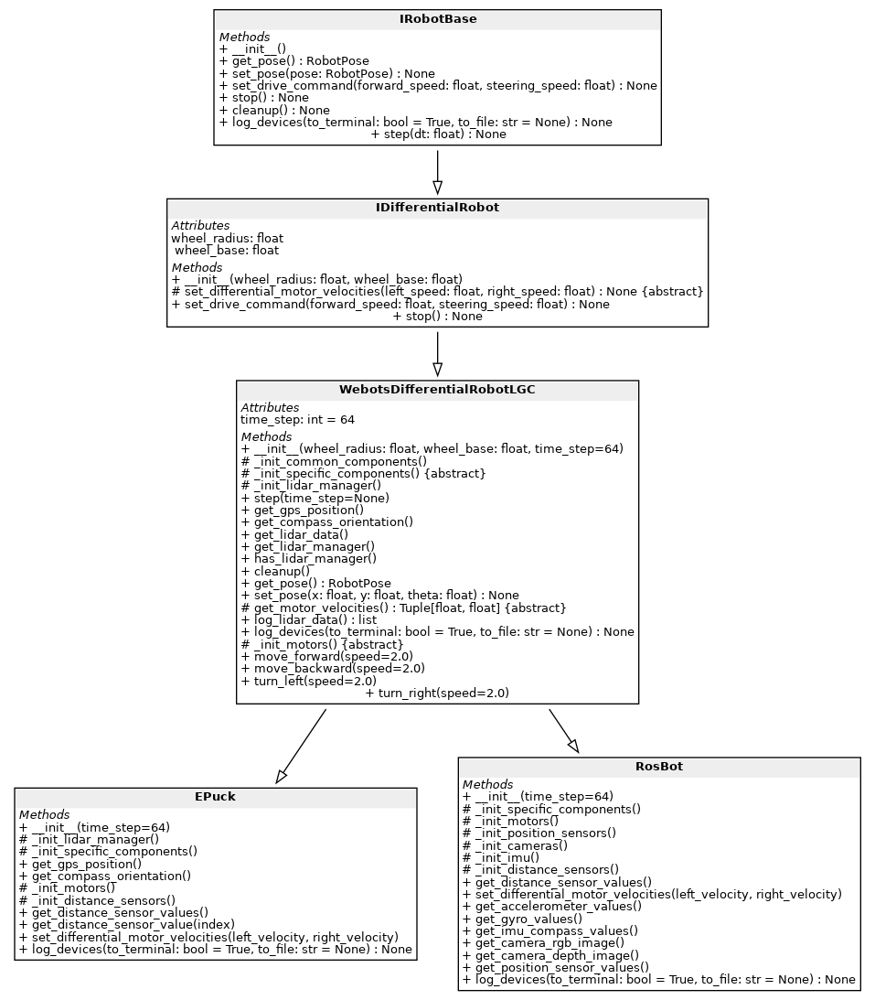

# Guía didáctica: Jerarquía de robots diferenciales y cómo usarla

> 
>
> El objetivo aprender, desde cero, a **usar** y **extender** la jerarquía.

---

## 1) Objetivos de aprendizaje
- Controlar un robot diferencial mediante una **API estable** (simulador u hardware).
- Entender la separación entre **interfaz** (qué) e **implementación** (cómo).
- Extender la jerarquía creando nuevas clases concretas.
- Escribir pruebas básicas para validar su implementación.

---

## 2) Mapa mental de capas (sin repetir el UML)

1. **`IRobotBase`**: capacidades mínimas (pose, comando general, parada, ciclo de control).
2. **`IDifferentialRobot`**: especialización para robots de **dos ruedas motrices** (comandos `(wl, wr)` y utilidades).
3. **Base de plataforma** (p. ej. `WebotsBaseDifferentialRobot`): inicialización y utilidades de **una plataforma** concreta.
4. **Clases concretas** (`RosbotRobot`, `EPuckRobot`): detalles del robot (motores, sensores, conversiones).

**Regla de oro:** programa contra **interfaces**; cambia de robot sin tocar tu lógica de control.

---

## 3) Inicio rápido (5 min)

### 3.1. Elegir clase concreta
- Webots → `EPuckRobot` (o tu subclase de la base Webots).
- ROSbot → `RosbotRobot`.

### 3.2. Bucle mínimo de control
```python
robot = EPuckRobot()  # o RosbotRobot(), etc.
for _ in range(1000):
    robot.step()        # avanza la simulación / ciclo de control
    robot.set_drive_command(0.1, 0.0)    # v=0.1 m/s, w=0 rad/s (avanzar recto)
robot.stop()
```

### 3.3. Obtener la pose/odometría
```python
pose = robot.get_pose()   # (x, y, yaw) o equivalente
print(pose)
```

---

## 4) Dos formas de mandar movimiento

Elige **una** y sé consistente:
1) **Cinemática del chasis**: `set_drive_command(v, w)`  
2) **Velocidades de ruedas**: `set_differential_motor_velocities(wl, wr)`

La jerarquía asegura que ambas rutas están disponibles.

---

## 5) Patrón de uso en prácticas

1. Instancia el robot.
2. En cada ciclo:
   - `step`
   - Lee sensores (si procede)
   - Calcula `v, w` (o `wl, wr`)
   - Envía el comando correspondiente
3. Llama a `stop()` al finalizar.

---

## 6) Extender la jerarquía: tu propio robot

### 6.1. ¿De qué clase heredar?
- Si es diferencial **y** tienes base de plataforma → hereda de la **base de plataforma**.
- Si es diferencial sin base → hereda de `IDifferentialRobot`.
- Si no es diferencial → hereda de `IRobotBase`.

### 6.2. ¿Qué implementar?
- Inicialización de **motores** y **sensores** (métodos tipo `_init_motors`, `_init_distance_sensors`, `_init_specific_components`).
- Conversión de `(wl, wr)` a comandos de actuador: `set_differential_motor_velocities(wl, wr)`.
- (Opcional) gestores de sensores (ej. LIDAR).

### 6.3. Esqueleto de subclase
```python
class MyRobot(WebotsBaseDifferentialRobot):
    def __init__(self, **kwargs):
        super().__init__(**kwargs)

    def _init_specific_components(self):
        pass

    def _init_motors(self):
        pass

    def _init_distance_sensors(self):
        pass

    def set_differential_motor_velocities(self, wl, wr):
        pass
```

---

## 7) Buenas prácticas y errores comunes
- No mezcles `(v, w)` y `(wl, wr)` sin controlar la conversión.
- Mantén `step()` en un **timestep** estable.
- Verifica unidades (m/s vs rad/s).
- Si no se mueve, revisa inicialización y que no se haya quedado en `stop()`.

---

## 8) Mini–práctica (30–45 min): Seguir una pared (e-puck)

1) Bucle de 2000 pasos.  
2) Lee sensor lateral.  
3) `e = d* - d`.  
4) `w = k_p * e`, `v` constante.  
5) Envía `set_drive_command(v, w)`.  
6) Ajusta `k_p` y analiza.

---

## 9) Pruebas rápidas (pytest)
```python
def test_interfaces_basicas():
    r = EPuckRobot()
    r.set_drive_command(0.1, 0.0)
    r.set_differential_motor_velocities(1.0, 1.0)
    for _ in range(5):
        r.step()
    assert r.get_pose() is not None
```

---

## 10) Checklist para un robot nuevo
- [ ] Herencia correcta (IDifferential o base de plataforma)  
- [ ] Motores/sensores inicializados donde toca  
- [ ] `set_differential_motor_velocities` implementado y con unidades correctas  
- [ ] `step()` sincroniza entradas/salidas  
- [ ] `stop()` detiene de forma segura  
